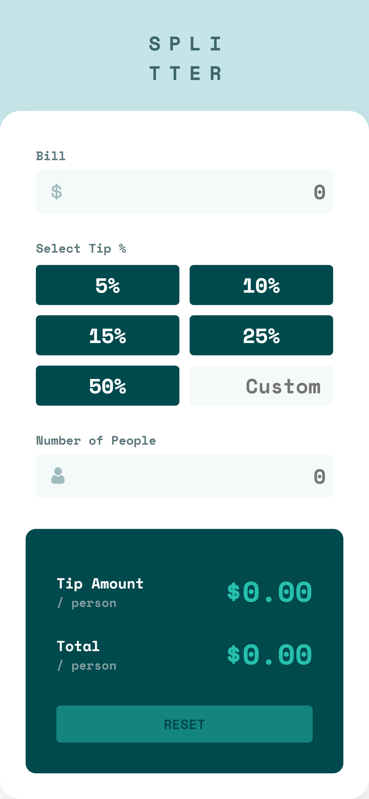
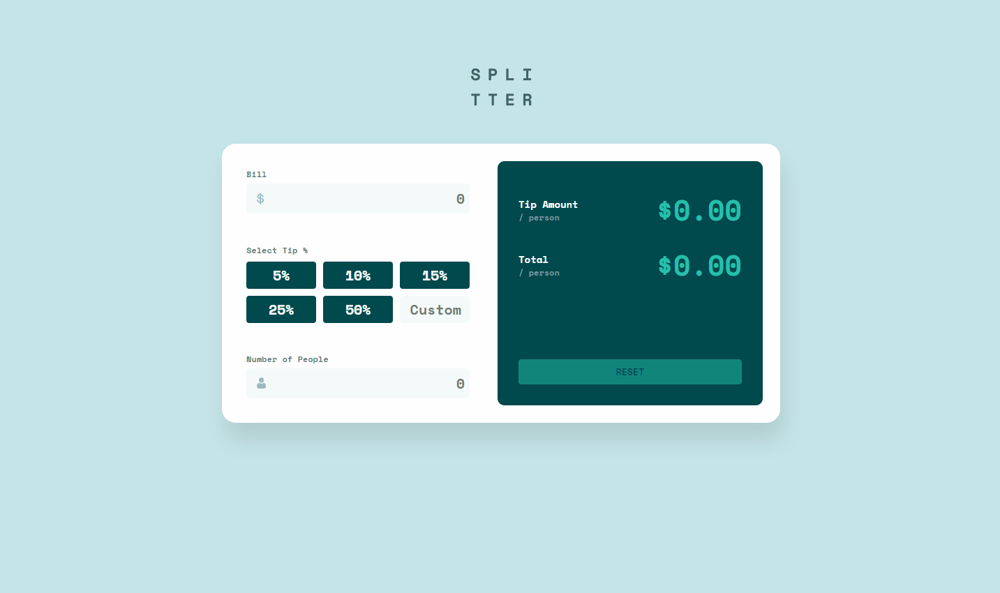

# Sobre o Projeto
Projeto clone do desafio [FrontEnd Mentor](https://www.frontendmentor.io/challenges/tip-calculator-app-ugJNGbJUX) 

## Desing Mobile	


## Design Desktop


## Tecnologias utilizadas
* React
* CSS Module

## Rodar projeto em ambiente de desenvolvimento
navegar até a pasta /frontend
```
cd .\frontend\
```
instalar pacotes npm
```
npm install
```
rodar projeto
```
npm start
```
